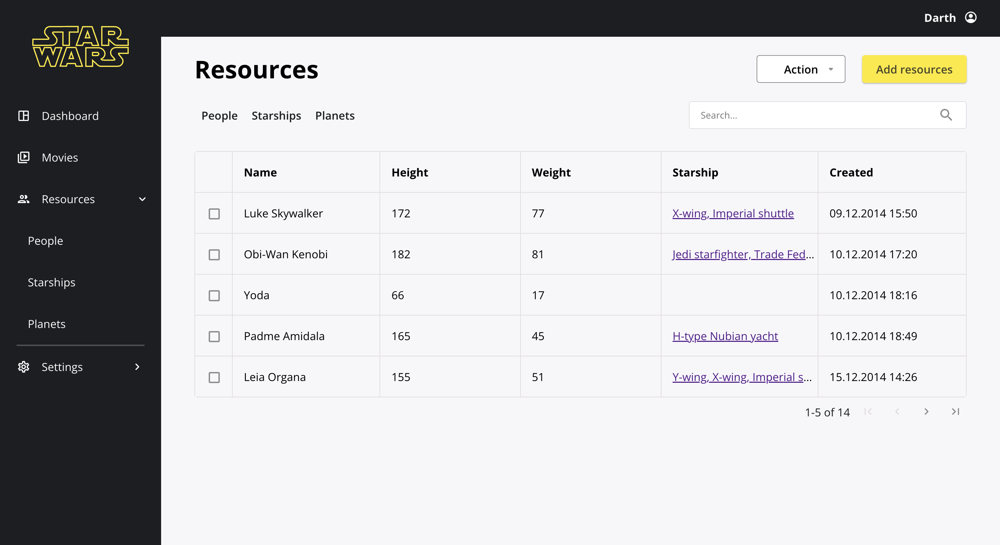
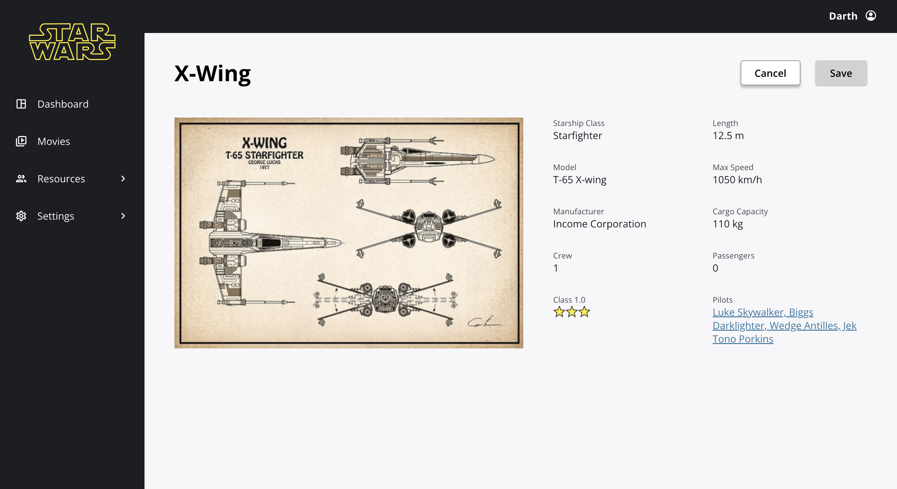
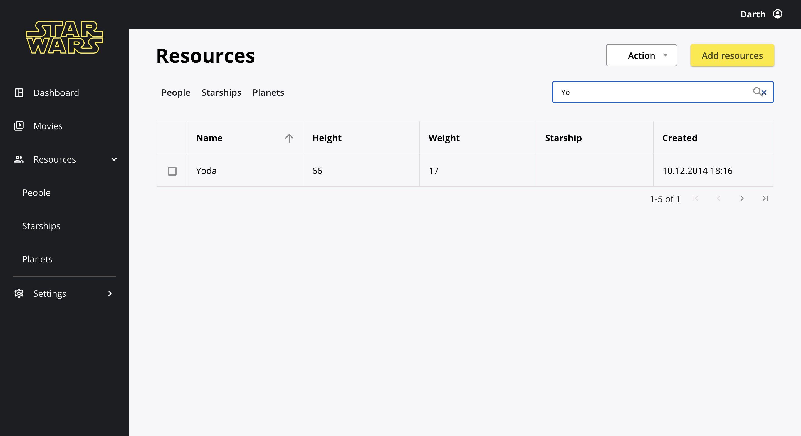

# Star Wars task

Welcome to the Star Wars page!



You can check information about the X-Wing starship.



The table features a sorting functionality.


The table supports search functionality based on name.



## Running localy

In the project directory, you can run:

```
npm start
```

The App will start running at [http://localhost:3000](http://localhost:3000).

## Deployment

The App is deploed on Netlify and can be found here:

[](https://public.bc.fi/s2300111/pokeDex/)

### Link to my GitHub

[](https://github.com/MariiaSizova)
